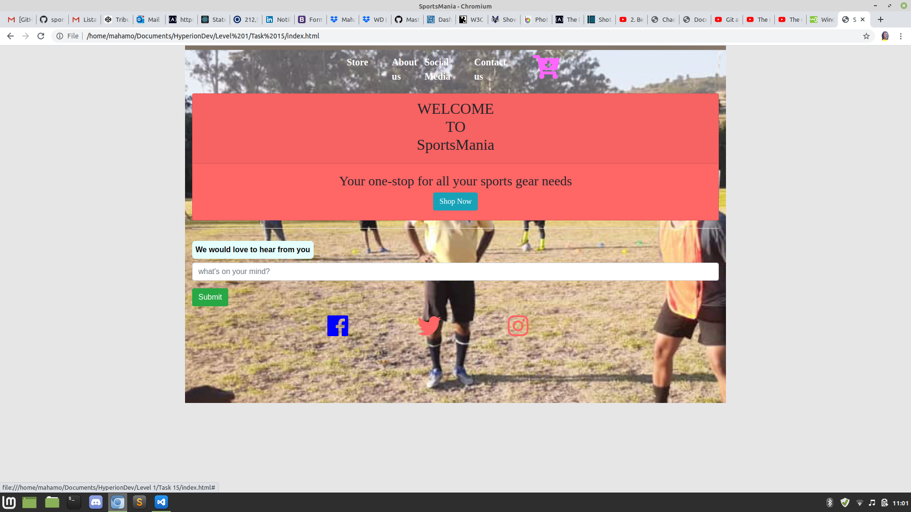
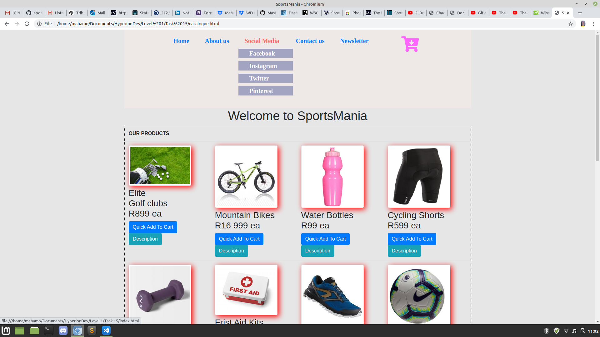
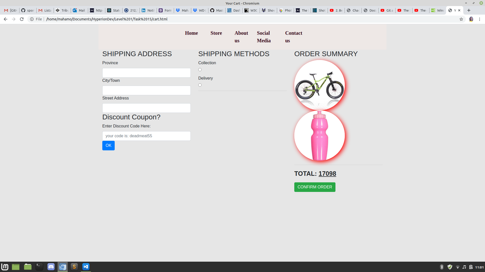

# sportsMania

### Contents:
1. About sportsMania
2. Table outlining the contents of the main pages of sportsMania
3. Installation
4. Features and usage
5. Authors

### About sportsMania
 sportsMania simulates an online sports shop. It has a catalogue of items with descriptions and an option to add them to a cart.
 The mock online store was created to enhance the author's HTML, CSS and JavaScript skills.

### Table outlining the  contents of the main pages of sportsMania

Home | Catalogue | About | Cart
---- | --------- | ----- | ----
Shop Now shortcut | products for sale | Our story | shipping address and discount coupon entry
social media icons | sign up area for newsletter | Testimonials | shipping methods section
feed back bar | email contact option | navigation bar | order summary section

### Installation
* Simply clone repository as is and save in single directory.
* Open index.html with your web browser and voila!

### Features and usage
* Adding items to the cart alerts the user of the total due at present 
* The number of items present in the cart is shown
* Clicking on the cart icon lands the user on the checkout page where pictures of items in the cart are shown
* The checkout page has several sections and includes a field for entering a discount coupon
* A discount of 10% is available if user enters a discount code
* The final total depends on the shipping method chosen
* Hovering over Social Media in the navigation tab produces a dropdown menu that shows the different social media sites on which the shop is active
* Detailed descriptions of each item are available. Simply click the description button

### Authors
* Mahamo Ranoka

